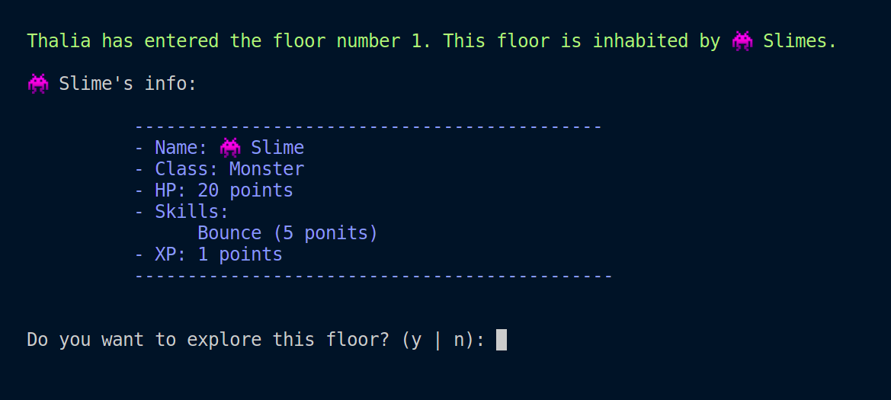

# Javascript Project by DCI - RPG Game

## About the Project

The idea was to recreate a fantasy RPG Game using only javascript and the output is on the console.

### The game is devided in 2 parts:
The part where the user create, choose or log back into the game.

The user has 3 possibilieties:
- create a new character, adding the name, class and choosing 3 different skills from the chosen class
- Log back into the game with a character already created before
- Choose a character from the default list and play as a guest (The only downside is that when the user exit the game the default character get reseted)  

The second part is the game itself

Here the user has 5 possibilities:
- Player Vs Player: where the player fights against other players

when the players win. The message that is shown is:

And in the opposite case:

- Explore a Dungeone: where the user chooses a dungeon to explore and fights against the monsters inside of each floor of the Dungeon

After choosing:

Each Floor (expect the boss floor) has 5 of the same monster, that the player has to fight to go to the next floor.

- Open the status: see the player info

- Distributing Experience Points: where the player chooses a skill to which they want to increase their damage/recover points by the XP they have

- And last is to exit the game. In case the user played with a created a character, this will be saved in the database of players without losing any points gained during the game.

## Tools
- Javascript
- Git
- npm
- readline-sync
- colors
- file system

## Ideas for the Future:

- Cooldown: adding a cooldown for the skills so that the player can't use the most powerfull skill all time but has to use all of them
- Graphic: implements this code with HTML/CSS to make it more graphical
- Gain New Skills: when the player levels up the have the possibility to add new skills.

